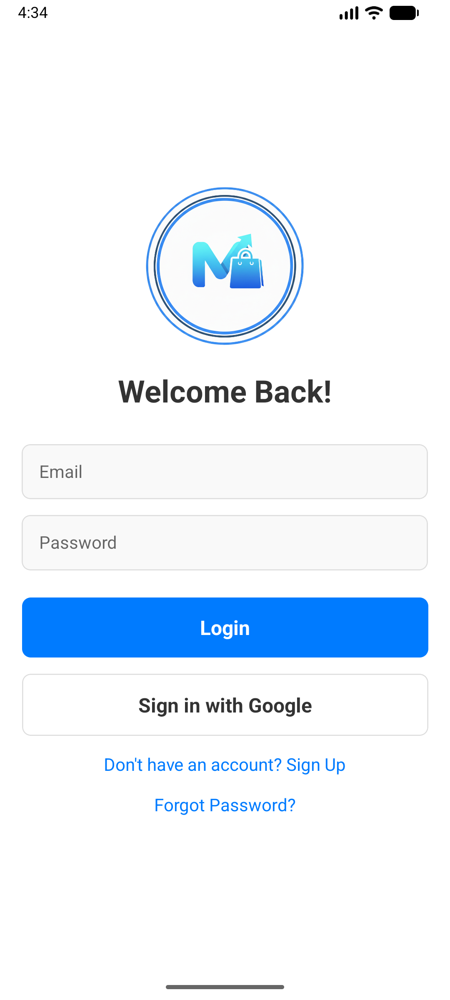
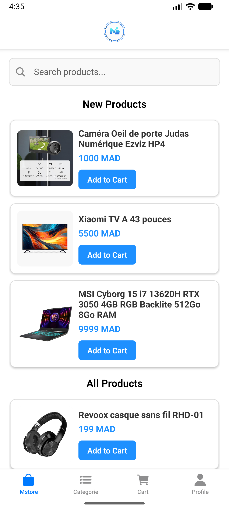
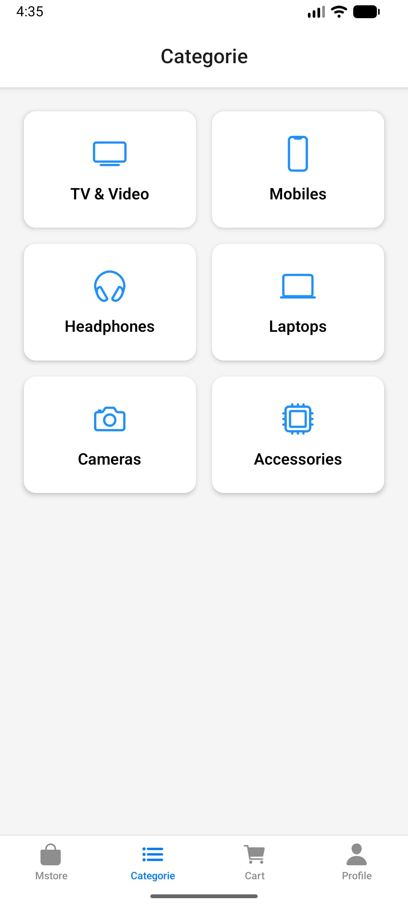

# 🛍️ React Native E-Commerce App

A professional, full-featured mobile e-commerce application built with **React Native**, **Expo**, and **Firebase**. This app provides a seamless shopping experience for users and includes a dedicated dashboard for administrators.

---

## 📱 Features

### User Features
*   **Authentication**: Secure Login, Sign Up, and Forgot Password functionality.
*   **Product Browsing**: Browse products by categories, view detailed product information.
*   **Shopping Cart**: Add items to cart, manage quantities, and review orders.
*   **User Profile**: Manage profile details, view order history (`My Orders`), and settings.
*   **Search & Filter**: Efficiently find products (implemented in UI).

### Admin Features
*   **Dashboard**: Comprehensive admin dashboard to manage the store.
*   **Product Management**: Add, edit, and delete products.
*   **Order Management**: View and track customer orders.

---

## 🛠️ Tech Stack

*   **Framework**: [React Native](https://reactnative.dev/) (via [Expo](https://expo.dev/))
*   **Navigation**: [React Navigation](https://reactnavigation.org/) (Stack & Bottom Tabs)
*   **Backend**: [Firebase](https://firebase.google.com/)
    *   **Authentication**: User management.
    *   **Firestore**: Real-time database for products, categories, and orders.
    *   **Storage**: Image hosting for product assets.
*   **Styling**: Custom Styles & Vector Icons.

---

## 📸 Screenshots

| Screen 1 | Screen 2 | Screen 3 |
|:---:|:---:|:---:|
|  |  |  |

*(Add your actual screenshots in the `assets` folder and update the paths above)*

---

## 🚀 Getting Started

Follow these instructions to set up and run the project locally.

### Prerequisites
*   Node.js installed on your machine.
*   [Expo Go](https://expo.dev/client) app installed on your generic Android/iOS device (or an Emulator).

### Installation

1.  **Clone the repository:**
    ```bash
    git clone https://github.com/yourusername/ecommerce-app.git
    cd ecommerce-app
    ```

2.  **Install dependencies:**
    ```bash
    npm install
    # or
    yarn install
    ```

### 🔑 Configuration (Firebase)

This project uses Firebase. You need to provide your own Firebase configuration keys.

1.  Create a project in the [Firebase Console](https://console.firebase.google.com/).
2.  Enable **Authentication** (Email/Password).
3.  Enable **Firestore Database** and **Storage**.
4.  Get your web configuration object.
5.  Open `firebaseConfig.js` in the project root and update it:

    ```javascript
    // firebaseConfig.js
    import { initializeApp } from "firebase/app";
    // ... other imports

    const firebaseConfig = {
      apiKey: "YOUR_API_KEY",
      authDomain: "YOUR_AUTH_DOMAIN",
      projectId: "YOUR_PROJECT_ID",
      storageBucket: "YOUR_STORAGE_BUCKET",
      messagingSenderId: "YOUR_MESSAGING_SENDER_ID",
      appId: "YOUR_APP_ID"
    };

    // ... initialization code
    ```

---

## 🏃‍♂️ Running the App

Start the development server:

```bash
npx expo start
```

*   Press `a` to run on Android Emulator.
*   Press `i` to run on iOS Simulator.
*   Scan the QR code with the **Expo Go** app on your physical device.

---

## 📂 Project Structure

```
├── assets/          # Images and fonts
├── components/      # Reusable UI components
├── screens/         # App screens (Home, Login, Cart, etc.)
│   ├── Dashboard.js # Admin Dashboard
│   └── ...
├── services/        # API services (Firebase auth, Firestore)
├── App.js           # Main Entry point & Navigation Setup
├── firebaseConfig.js# Firebase Configuration
└── package.json     # Dependencies & Scripts
```

---

## 🤝 Contributing

Contributions are welcome! Please fork the repository and submit a pull request for any improvements or bug fixes.

1.  Fork the Project
2.  Create your Feature Branch (`git checkout -b feature/AmazingFeature`)
3.  Commit your Changes (`git commit -m 'Add some AmazingFeature'`)
4.  Push to the Branch (`git push origin feature/AmazingFeature`)
5.  Open a Pull Request

---

## 📄 License

This project is licensed under the MIT License - see the [LICENSE](LICENSE) file for details.
